# srinivasa-says

Un juego al estilo _Simon Says_ basado en ATmega328P que reproduce dígitos de π en notas musicales.

Este fin de semana me aburrí, así que decidí desempolvar mis escasos conocimientos en electrónica de la carrera y diseñar una PCB de un pequeño juego con el que chapuceé hace tiempo. El objetivo es hacer una PCB portátil y bonita para poder jugar al Srinivasa Says en cualquier lugar. ¿Qué es esto? Fácil, ¿conoces el Simon Says? Sí, lo conozco. Pues bien, Srinivasa no te cuenta tonos de música cualesquiera, sino dígitos de π. Y tú has de memorizarlos y reproducirlos. Increíble, ¿verdad? Pongámonos a ello.

https://github.com/user-attachments/assets/b9acbc8d-a9ce-4489-b028-960156978bec

## TL;DR

### Resumen del proyecto

**Concepto**: dispositivo interactivo que asocia un teclado numérico a frecuencias sonoras, permitiendo crear música o jugar en un modo de memoria donde los fallos activan una señal de error.

* **Hardware principal**: microcontrolador [ATmega328P-PU](https://ww1.microchip.com/downloads/en/DeviceDoc/ATmega48A-PA-88A-PA-168A-PA-328-P-DS-DS40002061B.pdf) montado con un cristal externo de 16 MHz para garantizar la precisión temporal de las notas.
* **Salida de audio**: buzzer pasivo piezoeléctrico con un circuito de control de volumen analógico mediante un trimmer de 10 kΩ y resistencias de protección.
* **Gestión de potencia**: alimentación flexible a través de USB-C o baterías, protegida por un interruptor rocker y reguladores de tensión.
* **Interfaz visual**: LEDs controlados por transistores BJT 2N3904 que actúan como drivers para evitar el consumo excesivo de corriente desde los pines del microcontrolador.

## Herramientas y software

El desarrollo del proyecto integró diversas disciplinas de ingeniería mediante el siguiente stack tecnológico:

* **Diseño electrónico**: [EasyEDA](https://oshwlab.com/agarnung/srinivasa-says) para la creación del esquemático y el ruteado de la pcb, permitiendo la exportación de modelos 3d para su integración mecánica.
* **Simulación de sistemas**: [Proteus 8.12](https://www.labcenter.com/whatsnew/8.12/) para validar la lógica del código y el comportamiento del hardware antes de la fabricación física.
* **Desarrollo de firmware**: [WinAVR](https://winavr.sourceforge.net/) y [avr-gcc](https://winavr.sourceforge.net/) para compilar código en c puro. Usado a través de [Microship Stuio](https://www.microchip.com/en-us/tools-resources/develop/microchip-studio) (antes [Atmel Studio](https://www.microchip.com/en-us/tools-resources/develop/microchip-studio)).
* **Modelado mecánico**: [Blender](https://www.blender.org/) para diseñar la carcasa protectora. [Fusion](https://www.autodesk.com/es/products/fusion-360/overview) para el diseño de los botones táctiles personalizados.
* **Fabricación aditiva**: [BambuStudio](https://bambulab.com/es/download/studio) para la laminación y [Bambulab A1 mini](https://bambulab.com/es/a1-mini) para la impresión 3D de las piezas.
* **Grabación de hardware**: programador [USBASP](https://www.tiendatec.es/maker-zone/programadores/526-programador-usbasp-v20-avr-icsp-con-cable-para-arduino-8405261440008.html) y la herramienta [AVRDUDE](https://github.com/avrdudes/avrdude) (a través de su GUI [AVRDUDESS](https://blog.zakkemble.net/avrdudess-a-gui-for-avrdude/)) para cargar el archivo .hex directamente en el chip mediante la interfaz ISP.

Todo el material disponible en las [Releases](https://github.com/agarnung/srinivasa-says/releases) de este repo:

- **Diseño mecánico**: Archivos CAD, 3D (STL, OBJ) del diseño mecánico destinado a la impresión 3D del sistema. En mechanical_design.zip.
- **Diseño eléctrico/eléctrónico**: Imágenes de PCB y capas/pistas. Archivos Gerber y esquemático. Simulación de Proteus. En electronic_design.zip.
- **Código fuente y binarios**: En program.zip.

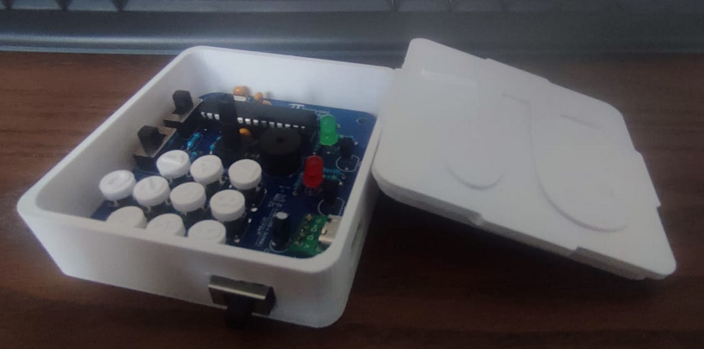

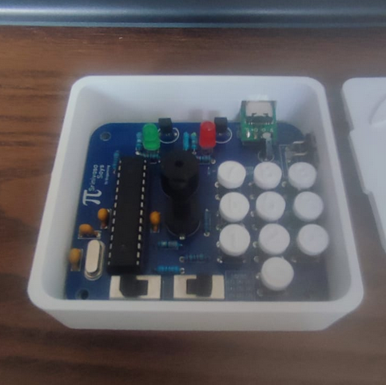

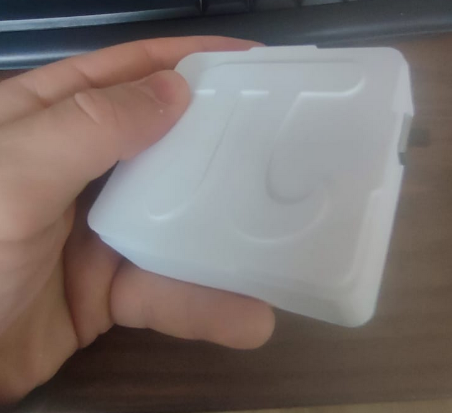


## Estudio previo y documentación

### Funcionamiento deseado

El funcionamiento sería: Hay un teclado numérico (del 0 al 9) y cuando pulsas las teclas, se reproduce una musiquita correspondiente a una frecuencia adecuada de más grave a más agudo (0 grave, 9 agudo), y cuando pulsas un botón fallado, suena un "MEEEC", y se acaba el juego y se puede reiniciar inmediatamente. Y los botones que sobren (si es que sobran, según el diseño hecho del teclado, si no con otros switches), pueden habilitar o no el sonido, o modos especiales de juego, etc.

### Elección del microcontrolador

El ATmega328PU (en encapsulado DIP) es una excelente opción por:

- Bajo costo (≈2,5 € en [AliExpress](https://es.aliexpress.com/item/1005004505177113.html?spm=a2g0o.productlist.main.3.31a61171s0tDlx&algo_pvid=228027c7-779f-47e5-bf37-801674c2398d&algo_exp_id=228027c7-779f-47e5-bf37-801674c2398d-1&pdp_ext_f=%7B%22order%22%3A%22476%22%2C%22eval%22%3A%221%22%7D&pdp_npi=4%40dis%21EUR%213.24%210.99%21%21%213.42%211.05%21%40211b61a417428957065718703ea741%2112000034342483624%21sea%21ES%210%21ABX&curPageLogUid=DKH1qhtjkcjF&utparam-url=scene%3Asearch%7Cquery_from%3A)).

- Suficiente memoria (32 KB flash, 2 KB RAM) (ver [Mouser](https://www.mouser.es/ProductDetail/Microchip-Technology/ATMEGA328P-PU?qs=K8BHR703ZXguOQv3sKbWcg%3D%3D)).

- Compatibilidad con Arduino (facilita programación).

Otras opciones económicas:

- [ATTiny85](https://www.mouser.es/ProductDetail/Microchip-Technology/ATTINY85-20PU?qs=8jWQYweyg6NCiiaOb5GI9Q%3D%3D) (más barato pero con menos pines/memoria).

- [STM8S003F3](https://www.st.com/en/microcontrollers-microprocessors/stm8s003f3.html) (alternativa ARM de bajo costo).

## Diseño electrónico

**¡Echa un ojo al proyecto publicado en abierto en _OSHWlab_!: [https://oshwlab.com/agarnung/srinivasa-says](https://oshwlab.com/agarnung/srinivasa-says).**

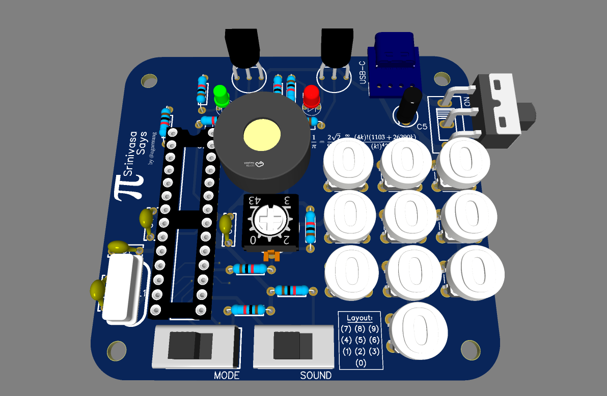

Se está usando **_EasyEDA_** ([enlace al diseño](https://oshwlab.com/agarnung/srinivasa-says)). Ver [videotutorial](https://www.youtube.com/watch?v=N0Cjnw3HrTI) de EasyEDA con ATmega328PU muy útil. Y para el desarrollo y envío PCB, una de las opciones más queridas es **JLCPCB** (abrir desde la propia página landscape de EasyEDA), aunque se pueden explorar otras que te den primeros envíos gratis.

**¡Solo nos ha costado 5 €, a 1 € por PCB, el envío por _JLCPCB_!**

> [!NOTE]
> Basado en las [mejores prácticas](https://electronics.stackexchange.com/questions/506766/microcontroller-unused-pins-configuration), la opción más adecuada para los pines no utilizados en el sistema sería configurar esos pines de la siguiente manera:
>
> - **Configurar los pines no utilizados como salidas**. Esto se debe a que los pines configurados como salidas tienen una impedancia baja, lo que asegura que no puedan capturar señales ruidosas del entorno (lo que puede ocurrir si se dejan como entradas flotantes).
>
> - **Configurar los pines como salidas y ponerlos en nivel bajo o alto**:
>   Cuando se configuran como salidas, una buena práctica es asegurarse de que los pines estén en un estado definido, es decir, en nivel bajo o nivel alto, para evitar el consumo innecesario de corriente por parte de las resistencias internas de pull-up o pull-down si no se configuran adecuadamente.
>
> - **Si se dejan pines como entradas**, es posible utilizar resistencias pull-up o pull-down internas (dependiendo de las necesidades del circuito) para mantener los pines en un estado definido.

_El diseño y enrutado de la PCB no siguen las mejores prácticas; se piden disculpas preventivas a los puristas de las PCB_.

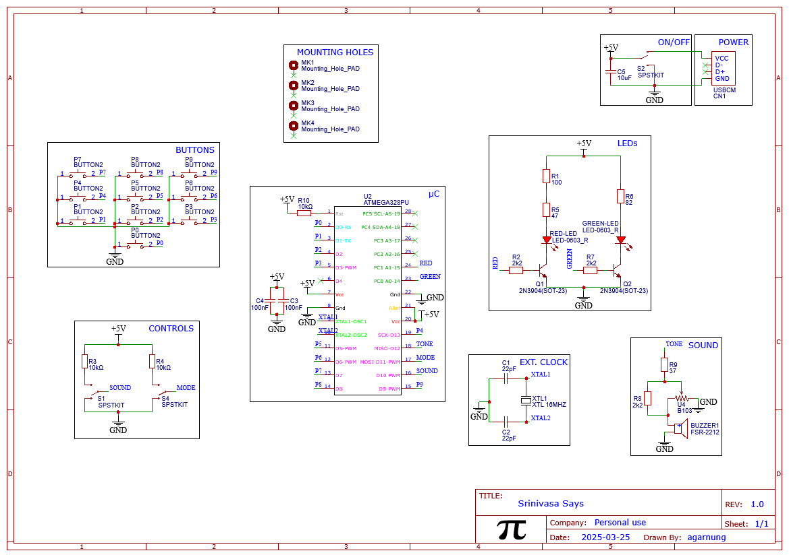 

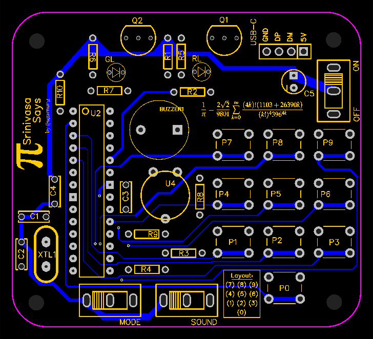 


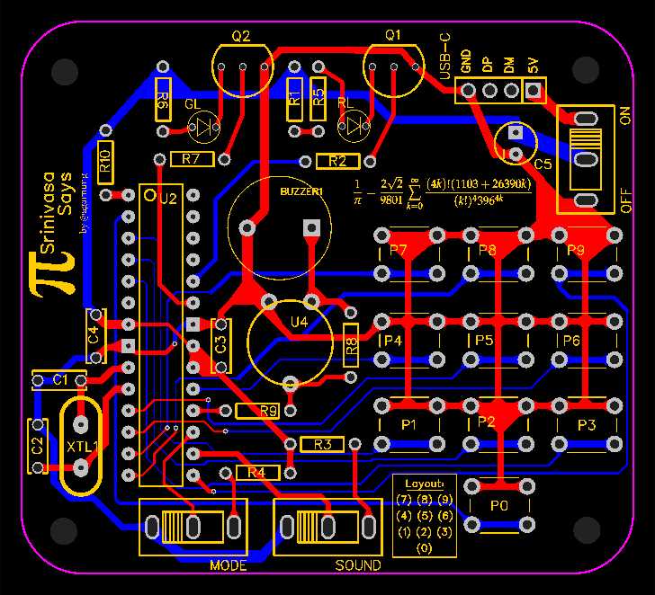 

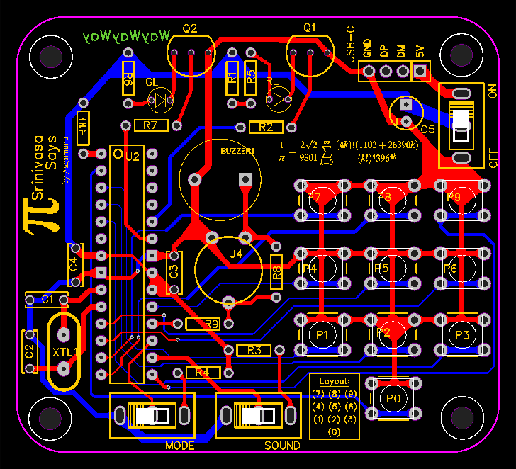 

### Periferia básica

Naturalmente usaremos resistencias pull-up o pull-down para que las entradas a las que estén conectados botones tengan un estado definido cuando los botones no estén presionados. El ATmega328 ya tiene resistencias de pull-up o pull-down internas, por lo que podríamos prescindir de ellas en el diseño de la PCB.

> [!NOTE]
> **¿Cuándo usar y no usar las resistencias de pull-up o pull-down internas del uC?**
>
> ✅ **Se recomienda usarlas** en aplicaciones simples, especialmente cuando:
> - El botón está cerca del uC.
> - El entorno no es eléctricamente ruidoso.
> - No necesitas compartir (muxear) el pin para otras funciones.
>
> ❌ **No se recomienda usarlas** cuando:
> - El cable del botón es largo o atraviesa un entorno ruidoso.
> - Se necesita mayor robustez eléctrica.
> - El pin I/O será usado para funciones múltiples (entrada/salida).
> - Requieres una resistencia más fuerte (por ejemplo, 10 kΩ en lugar de los ≈100 kΩ internos).

Por tanto, no las usaremos para los switches ni para los LEDs, pero sí para los botones.

Se escogen 10 [botones estándar de cuello largo](https://www.sunrom.com/p/tactile-switch-6x6x10mm) para poder (como veremos a continuación) modelar e imprimir nuestros propios botones mediante 3D, que irán enganchados al cuello.

### LEDs

Aunque el ATmega328P puede manejar LEDs directamente, los transistores ofrecen ventajas significativas, pues puede suministrar hasta un máximo absoluto de 40 mA (aunque la suma de corriente de todos los puertos no debería exceder 200 mA) (ver pág. 308 [datasheet](https://ww1.microchip.com/downloads/en/DeviceDoc/ATmega48A-PA-88A-PA-168A-PA-328-P-DS-DS40002061B.pdf)) y un LED típico como BLABLA les basta con 20 mA. Pero a partir de 20 mA, el output voltage se degrada, como especifican en el datasheet. Así que vamos justos, por lo que usaremos transistores.

Algunas ventajas de usar transistores:

- Mayor corriente: Permiten controlar LEDs que requieren más corriente de la que el microcontrolador puede suministrar, reduciendo la carga sobre el uC.
- Aislamiento: Protegen al microcontrolador de posibles sobrecargas.
- Control de cargas más grandes: Son ideales para manejar múltiples LEDs o tiras LED de mayor potencia.

Así, usamos el clásico BJT NPN 2N3904 como driver del LED (también se podría usar un PNP o un MOSFET, dependiendo de las necesidades específicas; para este pequeño proyecto nos vale). No usaremos PWM; el encendido será siempre en estado alto porque no nos interesa graduarlo con dimming.

> [!INFORMATION]
> Ver [este vídeo](https://www.youtube.com/watch?v=wKIHAbnBCJM) y [este esquemático](https://www.circuitlab.com/circuit/gmmqaq/2n2222-led/).

#### Cálculo de las resistencias de los LEDs

Nuestra fuente de alimentación es de 5 V. Asumimos una corriente de alimentación de los LEDs de 20 mA (0.02 A) para asegurar su vida útil. Caída de voltaje del transistor 2N3904 en saturación de 0.2 V. Tensiones directas (de caída) de los LEDs: aprox. 2.0 V (rojo) y aprox. 2.2 V (verde). Por la ley de Ohm, según la tensión que debe caer en la resistencia que acompañe a cada LED:

**R_rojo**:

$$
R_{\text{rojo}} = \frac{5 - 2.0 - 0.2}{0.02} = 140\ \Omega
$$

⇒ resistencia **100 Ω + 47 Ω** comerciales en serie.

**R_verde**:

$$
R_{\text{verde}} = \frac{5 - 2.2 - 0.2}{0.02} = 80\ \Omega
$$

⇒ resistencia **82 Ω** comercial.

#### Cálculo de la resistencia de base

Al calcular la resistencia de base que debe haber entre uC y transistor, el objetivo es asegurarse de que, cuando funcione, el transistor esté en saturación (es decir, completamente "abierto"), lo que permite que fluya la máxima corriente posible a través del LED sin que el transistor se comporte como una resistencia en lugar de un interruptor.

1. Corriente de base (I_b): la relación entre la corriente de colector (I_c) y la corriente de base (I_b) está determinada por el hFE (ganancia de corriente; parámetro β) del transistor. Generalmente, para asegurar que el transistor esté en saturación, se recomienda utilizar una corriente de base que sea al menos 1/10 de la corriente de colector (ver [este enlace](https://electronics.stackexchange.com/questions/454905/how-can-we-find-the-value-of-beta-for-a-transistor-to-enter-in-a-saturation-regi)). Así:
   - Corriente de colector (I_c): es la corriente que pasa a través del LED y debe ser 20 mA (0.02 A).
   - Corriente de base (I_b): debe ser al menos I_b = I_c / β para que se abra completamente, en saturación.

$$
I_b = \frac{I_c}{\beta}
$$

E.g. con:
- I_c = 20 mA
- β ≈ 10

$$
I_b = \frac{20\ \text{mA}}{10} = 2\ \text{mA}
$$

2. Cálculo de la Resistencia de Base (R_b): la resistencia de base (R_b) se calcula teniendo en cuenta la caída de voltaje entre la base y el emisor del transistor (V_BE) y el voltaje de salida del microcontrolador (V_GPIO). El voltaje de salida del microcontrolador es típicamente de 5 V, y la caída de voltaje en el transistor 2N3904 en saturación es de aprox. 0.9 V (ver [datasheet](https://www.onsemi.com/download/data-sheet/pdf/2n3903-d.pdf) pág. 2, Base-Emitter Saturation Voltage).

La fórmula para calcular la resistencia de base es:

$$
R_b = \frac{V_{\text{GPIO}} - V_{BE}}{I_b}
$$

Sustituyendo valores:

$$
R_b = \frac{5 - 0.9}{0.002} = 2050\ \Omega \approx 2.2\ \text{k}\Omega
$$

Por lo tanto, la resistencia de base necesaria es 2.05 kΩ para asegurar que el transistor esté completamente saturado y pueda controlar correctamente la corriente del LED.

3. Resistencia de Colector para los LEDs: son las resistencias previamente calculadas según la corriente consumida por cada LED y su tensión de caída.

### Condensadores de desacoplamiento

Estos condensadores, típicamente cerámicos (de clase X7R o similar, con baja ESR), ayudan a filtrar el ruido y a estabilizar el suministro de energía. Se suelen colocar lo más cerca posible de los Pines de Alimentación del uC, uP o circuito integrado potencialmente sensible a microinterrupciones por el ruido, i.e. entre VCC y GND para minimizar la inductancia de las pistas y garantizar un filtrado efectivo. Una práctica común es colocar condensadores de aprox. 100 nF (0.1 uF) cerca de cada pin de alimentación del microcontrolador y además uno más grande (electrolítico o de tantalio, con voltaje nominal adecuado al de tu fuente de alimentación) de 4.7 µF a 10 µF entre VCC y GND cerca del microcontrolador para mejorar el filtrado de ruido de baja frecuencia (reducir los picos provenientes de la fuente de alimentación). Ver [este vídeo](https://www.youtube.com/watch?v=e8V_eC-euT8).

Como usaremos el ADC, colocaremos pues tres condensadores de desacoplamiento:

- Uno de 100 nF cerca, entre los pines VCC y GND del ATmega328P.
- Uno de 100 nF cerca, entre los pines AVCC y GND del ATmega328P.
- Uno de 10 µF (o 4.7 µF) entre VCC y GND de la placa cerca del microcontrolador.

### Reloj utilizado

> [!NOTE]
> El ATmega328 tiene un oscilador interno de 8 MHz, pero un oscilador externo (como un cristal de cuarzo o un oscilador externo) puede mejorar la precisión y estabilidad temporal en ciertos casos. Usar un cristal de cuarzo o un oscilador externo puede ser beneficioso para:
>
> - Mejorar la precisión de la frecuencia, ya que el oscilador interno puede variar con temperatura o tensión.
> - Proveer mayor estabilidad, ideal para generar frecuencias precisas.
> - Permitir usar frecuencias ajustables más altas o bajas.
> - Reducir interferencias eléctricas generadas por el oscilador interno.
>
> Un cristal de cuarzo es un componente pasivo que necesita un circuito adicional (generalmente condensadores) para funcionar, ofreciendo alta precisión. Un oscilador externo es un componente activo con su propia circuitería y es fácil de implementar, pero puede ser menos preciso y más costoso.
>
> Para usar un oscilador externo en el ATmega328, es necesario configurarlo mediante los fusibles del microcontrolador. Los pasos son:
>
> 1. Conectar el oscilador o cristal al pin correspondiente del microcontrolador.
> 2. Programar los fusibles del ATmega328 para seleccionar el oscilador externo. Por ejemplo, se puede ajustar el fusible CKSEL para elegir el tipo de fuente de reloj.
> 3. Usar herramientas como avrdude o Atmel Studio para programar los fusibles. Ver [esto](https://www.avrfreaks.net/s/topic/a5C3l000000U5cVEAS/t035403) o [esto](https://www.quora.com/How-do-I-add-an-external-oscillator-to-my-Atmega-16).

Junto con el oscilador externo de cuarzo de 16 MHz, se emplean dos capacitores cerámicos de 22 pF (valor típico) (entre los terminales del cristal y tierra), para garantizar un funcionamiento estable y preciso, ayudando a estabilizar la señal oscilante generada por el cristal y asegurando que la frecuencia de oscilación sea exacta, actuando como filtros para reducir el ruido y las fluctuaciones de voltaje que podrían afectar la señal del reloj.

### Switches

Como no quiero gastar los dos switches disponibles, que son demasiado grandes, usaremos botones convencionales para simular el comportamiento de switches mediante un flip-flop software. Esto se logrará con una interrupción en el microcontrolador (uC) que detectará los flancos de subida o bajada del botón, cuidando los rebotes del botón. 

Necesitaremos tres botones: uno para activar o desactivar el sonido, otro para especificar el modo de juego, y un tercero para encender y apagar la alimentación con la batería.

Se usan 3 botones de 6x6x8 mm.

### Buzzer

- Si se usa buzzer pasivo piezoeléctrico conectado a PWM, no hace falta usar resistencia. Pero debe ser pasivo, para que le demos nosotros el valor del tono en hercios. Ver [esto](https://www.exploreembedded.com/wiki/Buzzer_with_AVR).

Una opción activa sería [esta](https://www.todoelectronica.com/buzzer-5v-activo-24khz-p-110239.html) ([datasheet](https://www.farnell.com/datasheets/2171929.pdf)); solo le proporcionamos tensión para que suene, pero emite un tono fijo, lo que no nos interesa.

#### Trimmer

Para variar el volumen del aparato, en vez de usar el ADC del microcontrolador (y ajustar por software el ciclo de trabajo PWM que alimenta al buzzer), optamos por una solución puramente hardware, más simple y directa. Se emplea un potenciómetro (más bien, un trimmer) de 10 kΩ como **reóstato**, es decir, utilizando solo dos de sus tres terminales: uno extremo y el cursor. Esto permite que el potenciómetro funcione como una resistencia variable en serie, modificando la corriente que llega al buzzer pasivo y, por tanto, el volumen audible.

Sin embargo, el rango de 0 a 10 kΩ es demasiado amplio y poco sensible en el tramo útil para ajustar el volumen, además la resistencia nula podría causar sobrecorrientes no deseadas o, peor aún, un dolor de oídos. Por eso, limitamos empíricamente su efecto útil añadiendo una resistencia fija de 37 Ω en serie (para asegurar un mínimo volumen no nulo) y una resistencia de 2.2 kΩ en paralelo con el potenciómetro, de forma que cuando el potenciómetro está al máximo (10 kΩ), la resistencia total vista por el buzzer no supera cierto límite. El rango efectivo de control del volumen se define entonces aproximadamente entre 37 Ω (potenciómetro al mínimo) y ~1.84 kΩ (combinación de 10 kΩ en paralelo con 2.2 kΩ, más los 37 Ω en serie) ((10 k * 2.2 k) / (10 k + 2.2 k)). Así logramos que el control de volumen sea suave, útil y ajustable en un margen cómodo.

Resistencia equivalente del paralelo:

$$
R_{\parallel} = \frac{10\,\text{k}\Omega \cdot 2.2\,\text{k}\Omega}{10\,\text{k}\Omega + 2.2\,\text{k}\Omega}
$$

$$
R_{\parallel} \approx 1.8\,\text{k}\Omega
$$

Rango efectivo total del volumen:

$$
R_{\text{total}} \in [37\ \Omega,\ 1.84\ \text{k}\Omega]
$$

### Alimentación

Estimación de Consumo de Corriente por Componente

Si asumimos un ATmega328P corriendo todo el tiempo a 16 MHz:

(Botones solo consumen cuando son presionados. Su consumo es despreciable si no están conectados a tiras de LED u otras cargas.)

(Transistores Actúan como interruptores para los LEDs. Su corriente de colector será similar a la del LED que manejan. Consumo en base: podría considerarse despreciable comparado con el colector (≈ 1–2 mA), ya que ganancia hFE > 100. Ya considerado en la corriente de los LEDs.)

(Capacitores y Cristal Consumo neto: 0 mA (pasivos))

Buzzer Pasivo. Requiere una señal de oscilación. Supongamos que se activa mediante PWM desde un microcontrolador. Consumo típico: < 30 mA en operación. Si está activo 50% del tiempo: 15 mA promedio

Se asumieron 20 mA para el diseño inicial de resistencias de los LEDs, pero las resistencias comerciales dan un consumo real algo distinto. Los LEDs se conectan con resistencias para limitar la corriente, así que estimaremos su corriente usando Ohm: Rojo (con 47 Ω) Corriente = (5V - 2V) / 47Ω ≈ 64 mA, Verde (con 82 Ω) Corriente = (5V - 2.2V) / 82Ω ≈ 34 mA. Total LEDs: ~98 mA cuando ambos están encendidos

| Componente        | Corriente estimada (mA) |
|-------------------|-------------------------|
| LEDs              | 98 mA                   |
| Buzzer (50%)      | 15 mA                   |
| ATmega328P        | 20 mA                   |
| 2N3904 (base)     | 3.7 mA (1.86 mA × 2)    |
| **Total**         | **137 mA**              |

Si todos los componentes están activos de forma constante, la corriente total es 137 mA. Significa que, en cada segundo, tu circuito está usando 137 miliamperios de corriente. Entonces, ¿cuánto consume en una hora? El consumo por hora es 137 mAh (miliamperios-hora). Supongamos que usamos una batería de 1000 mAh (como muchas Li-Ion de 5V). Si el sistema consume 137 mA constantemente, se puede calcular cuánto durará así: 1000 / 137 mAh ≈ 7.3 horas. Dependiendo de nuestros requisitos, podemos calcular la capacidad que nos interese según el tiempo de funcionamiento deseado. Pero también hay otros sistemas de alimentación...

**Corriente total estimada**:

$$
I_{\text{total}} = 98 + 15 + 20 + 3.7 \approx 137\ \text{mA}
$$

**Duración estimada con batería de 1000 mAh**:

$$
t = \frac{1000}{137} \approx 7.3\ \text{h}
$$

Ver posibles opciones: https://chatgpt.com/c/6807fd66-defc-800d-8d9b-c8afb4ee375a
- La opción trivial es [pila no recargable](https://www-taydakits-com.translate.goog/instructions/arduino-memory-game/pages/the-circuit-diagram?_x_tr_sl=en&_x_tr_tl=es&_x_tr_hl=es&_x_tr_pto=sc), con [compartimento así](https://www.google.com/search?client=firefox-b-d&sca_esv=cc91aa7b516a412e&q=9V+compartment+pcb&udm=2&fbs=ABzOT_BnMAgCWdhr5zilP5f1cnRvK9uZj3HA_MTJAA6lXR8yQICx599sdFbm5siVC5WEzgEtp6o4DrSWTqdqZO8MP31kqbFKkqfL89nq1hvw37H6rIAZkda8kuMKVR-cNArA2C-Jqzbye-N8LF_PdCoDZ7Vk3Aa-uGiNe1r0OKhT74Chl1u6OO1zdLofrC-x1LqbUEmwe2Nm6KyK1QlH-CafREIBnR2Oag&sa=X&ved=2ahUKEwjK2JLO2uyMAxXo1AIHHeIZGJkQtKgLegQIIBAB&biw=1728&bih=812&dpr=1.11). Pero a nadie les gusta.
- ¿Comprar baterías Eneloop y cargador? (AA más grandes pero más capacidad que las AAA) (la única razón para comprar las de LADDA de IDEA en vez de Eneloop es si tenemos un IKEA cerca...): https://www.nloop-store.com/baterias/baterias-panasonic-eneloop.html.
- O [esta de petaca que da 9 V](https://www.nloop-store.com/bateria-recargable-powerex-mhr84v-300-nimh-8-4v-300mah.html) sin más y se puede usar un 7805 directamente Y YA. Y recargable [con esto](https://www.nloop-store.com/cargador-powerex-mh-c490f-para-4-baterias-9v-de-nimh.html), con [compartimento así](https://www.google.com/search?client=firefox-b-d&sca_esv=cc91aa7b516a412e&q=9V+compartment+pcb&udm=2&fbs=ABzOT_BnMAgCWdhr5zilP5f1cnRvK9uZj3HA_MTJAA6lXR8yQICx599sdFbm5siVC5WEzgEtp6o4DrSWTqdqZO8MP31kqbFKkqfL89nq1hvw37H6rIAZkda8kuMKVR-cNArA2C-Jqzbye-N8LF_PdCoDZ7Vk3Aa-uGiNe1r0OKhT74Chl1u6OO1zdLofrC-x1LqbUEmwe2Nm6KyK1QlH-CafREIBnR2Oag&sa=X&ved=2ahUKEwjK2JLO2uyMAxXo1AIHHeIZGJkQtKgLegQIIBAB&biw=1728&bih=812&dpr=1.11).
- U otra opción es usar un [conector USB](https://es.aliexpress.com/item/1005004960130059.html) y usar el juego solamente con algo cerca, y no haría falta regulador ni nada, salvo protecciones opcionales.
- U otra opción, como en [este proyecto](https://www.reddit.com/r/PrintedCircuitBoard/comments/yjvhvs/simon_says_using_atmega328/#lightbox), es usar [2 pilas de botón](https://www.amazon.es/CR2032-lithium-battery-watches-calculators/dp/B07B7M3SZM) (como las de tipo CR2032) sin más, que ya dan 6 V, y nos dejamos de leches (más un 7805). Como [este de amazon](https://www.amazon.es/EEMB-Bater%C3%ADas-Recargables-Capacidad-LIR2032H/dp/B09TKKBBV8?dib=eyJ2IjoiMSJ9.GsBfslnxvPrne-zCSDU9mK-Y6S825iwmwIBeI5O-nge5MOHaQCsTUJGo_tslp6yx0z5uc9LPi689Lkac-V4DjwErALRvhkTk-o5KPqdzn8Q-uwAykg8oNvKZA7t17wovrhTwSOtpc2KGLYI_cP2geWLhfs02Os0mWAF7-FcBtiO3IeByK2Mt_u6DekBfal5j2ANphgM7kmAHpQ49k-OaTJC4ts_sYIz18_aIz-ECYf2MkFemaV0fSGwdTALT6k8nAi_xk-zi6ChLcIxWHnl8K2qQOWgU6T-6sTc_Y25e3b8.KmKgUnFGmewy3FDEQ07UuyIfjor__St5n5V0iEGpLhA&dib_tag=se&keywords=CR2032&qid=1745359584&s=electronics&sr=1-5).
- O simplemente con conector como el de regulador de voltaje del Arduino, más un 7805, sin malditamente más complicaciones, como en este [Simon Dice](https://www.youtube.com/watch?v=PM0QySrv_M4).
- O usar **powerbank** como otra opción para Srinivasa!!! Como mi cargador portátil, y ya está me ahorro pilas https://chatgpt.com/c/6808315a-75ac-800d-9899-55bac21a3ab1, usando módulo adaptador USB a 5V o directamente microUSB o USB-C a la PCB. (Es como la opción con conector USB acoplado, realmente, solo que no se me ocurrió lo conveniente que es usar una powerbank, que también es portátil...).

### Protecciones

- Se puede poner un rocker switch para on/off en serie con línea de +V ([google](https://www.google.com/search?q=interruptor+SPST%2Frocker+pcb&client=firefox-b-d&sca_esv=cc91aa7b516a412e&q=interruptor+SPST%2Frocker+pcb&udm=2&biw=1728&bih=812&ei=Hv4HaOiOM5WckdUP2IfImQQ&ved=0ahUKEwjolciqv-yMAxUVTqQEHdgDMkMQ4dUDCBQ&uact=5&oq=interruptor+SPST%2Frocker+pcb&gs_lp=EgNpbWciG2ludGVycnVwdG9yIFNQU1Qvcm9ja2VyIHBjYkiaBlBoWMQFcAF4AJABAJgBZqAB3gKqAQMzLjG4AQPIAQD4AQGYAgCgAgCYAwCIBgGSBwCgB7QBsgcAuAcA&sclient=img#vhid=QvoHbnlV1droGM&vssid=mosaic)) ([chatgpt](https://chatgpt.com/c/6807fd66-defc-800d-8d9b-c8afb4ee375a))

## Bill of materials (BOM)

| Nombre del componente             | URL                                                                                      | Unidades | Precio unitario (USD) | Descripción               |
|-----------------------------------|------------------------------------------------------------------------------------------|----------|-----------------------|---------------------------|
| [5 mm Red LED](https://docs.rs-online.com/de32/A700000009318071.pdf) | [RS Online Red LED](https://es.rs-online.com/web/p/leds/2545717) | 1        | 0.082 €               | Error                     |
| [5 mm Green LED](https://docs.rs-online.com/49ec/A700000009318090.pdf) | [RS Online Green LED](https://es.rs-online.com/web/p/leds/2545715) | 1        | 0.07 €                | Acierto                   |
| [2N3904](https://www.onsemi.com/download/data-sheet/pdf/2n3903-d.pdf) [(buy)](https://es.aliexpress.com/item/1005005776290412.html?spm=a2g0o.productlist.main.4.14a428dfNZQ97V&aem_p4p_detail=2025062314395989473468263140000933285&algo_pvid=b8076ae9-d13a-445a-ba80-184e37e86575&algo_exp_id=b8076ae9-d13a-445a-ba80-184e37e86575-3&pdp_ext_f=%7B%22order%22%3A%2294%22%2C%22eval%22%3A%221%22%7D&pdp_npi=4%40dis%21EUR%210.87%210.80%21%21%210.98%210.90%21%4021038df617507147994917994e45f4%2112000034312643703%21sea%21ES%216234875547%21X&curPageLogUid=YBQrHbs3h6zT&utparam-url=scene%3Asearch%7Cquery_from%3A) | [Electrocomponentes 2N3904](https://www.electrocomponentes.es/transistores/176-315-transistor-bjt-2n3904-npn-40v-300mhz-200ma-625mw-30-300-hfe.html#/38-lotes-lote_1_unidad) | 2        | 0.25 €                | Driver de LED            |
| [47 ohm resistor](https://protosupplies.com/product/resistor-47-5/) | [datasheet](https://www.seielect.com/Catalog/SEI-CF_CFM.pdf) | 1        | $0.0236               | Para LED rojo             |
| [82 ohm resistor](https://protosupplies.com/product/resistor-82-5/) | [datasheet](https://www.seielect.com/Catalog/SEI-CF_CFM.pdf) | 1        | $0.0236               | Para LED verde            |
| [100 ohm resistor](https://protosupplies.com/product/resistor-100-5/) | [datasheet](https://www.seielect.com/Catalog/SEI-CF_CFM.pdf) | 1        | $0.0236               | Para LED rojo             |
| [2.2 kOhm resistor](https://protosupplies.com/product/resistor-2-2k-5/) | [datasheet](https://www.seielect.com/Catalog/SEI-CF_CFM.pdf) | 2        | $0.0236               | Para base del transistor  |
| [2.2 kOhm resistor](https://protosupplies.com/product/resistor-2-2k-5/) | [datasheet](https://www.seielect.com/Catalog/SEI-CF_CFM.pdf) | 1        | $0.0236               | Para potenciómetro del buzzer |
| [37 Ohm resistor]() | []() | 2        | $                     | Para buzzer               |
| [B103 trimmer](https://www.npncircuit.com/Monogiro/650-Trimmer-10K-orizzontale-15mm-THT-monogiro-PT15-M-V-103.html) or [potentiometer](https://www.amazon.com/-/es/Waziaqoc-potenci%C3%B3metro-resistencias-variables-recortador/dp/B0CYPQTQBT?dib=eyJ2IjoiMSJ9.Z-QK3IOlcrqA5uTIJuwnW_XaY6QHwuLQEADQ7lxd42IZO9xAk2Gxuo_HsPVtIS_EE9RINMEgwlhUv67i_Z6Mj_uVJrLAtl_9hiu36GG5H0C7znlHLp86gBZmRL38HP6YFXZPQaqbkApkhBWj4vTuBqcjZYs_THvYoqmquqdvMYGxl6Jz1n0Y8VIauajXY6V012eLgrFEH3I9ipvAuiiYX8yIY6qnGC1DAeZyysk_EM8.z5vpJw7-7G_kN8WIyG5pkRyRU3q7ZLgWIvO20lkeUEI&dib_tag=se&keywords=potentiometer%2Barduino&qid=1750708242&sr=8-13&th=1) [(buy)](https://es.aliexpress.com/i/1005008564922023.html) [(buy 2)](https://www.otronic.nl/en/10k-ohm-trim-potentiometer-horizontal-with-knob-of.html)| []() | 2        | $                     | Para buzzer               |
| [0.1 µF Ceramic Capacitor](https://www.mouser.es/ProductDetail/Vishay-BC-Components/K104K10X7RF5UH5?qs=rLgk8CAOBHbAqIwDswVbzA%3D%3D) [(buy)](https://es.aliexpress.com/item/1005002290441861.html?spm=a2g0o.productlist.main.11.37178g4i8g4i0Q&algo_pvid=e0e3efb8-965e-4646-920f-1affcc1a732d&algo_exp_id=e0e3efb8-965e-4646-920f-1affcc1a732d-10&pdp_ext_f=%7B%22order%22%3A%22628%22%2C%22eval%22%3A%221%22%7D&pdp_npi=4%40dis%21EUR%211.06%210.91%21%21%211.19%211.02%21%40211b6c1917507148487532964e1973%2112000020462004307%21sea%21ES%216234875547%21X&curPageLogUid=L867y55DWlS7&utparam-url=scene%3Asearch%7Cquery_from%3A) | [datasheet](https://www.vishay.com/docs/45171/kseries.pdf) | 2        | 0.219 €                | Decoupling                |
| [10 µF Electrolytic Capacitor ESK106M025AC3](https://www.mouser.es/ProductDetail/KEMET/ESK106M400AH2EA?qs=9RUIYXQlAdAOR1GXIoSF3A%3D%3D) [(buy)](https://es.aliexpress.com/item/1005001955264512.html?spm=a2g0o.productlist.main.8.295c395e7XUBtA&aem_p4p_detail=20250623144136999409303421060000872326&algo_pvid=24c29ee3-237e-49b6-97a0-8648ea5c526b&algo_exp_id=24c29ee3-237e-49b6-97a0-8648ea5c526b-7&pdp_ext_f=%7B%22order%22%3A%2229%22%2C%22eval%22%3A%221%22%7D&pdp_npi=4%40dis%21EUR%212.30%211.86%21%21%212.58%212.09%21%40210384b917507148960012200e1127%2112000018217913479%21sea%21ES%216234875547%21X&curPageLogUid=cVmdzP3TzCQy&utparam-url=scene%3Asearch%7Cquery_from%3A&search_p4p_id=20250623144136999409303421060000872326_8) | [datasheet](https://www.mouser.es/datasheet/2/447/KEM_A4004_ESK-3316395.pdf) | 1        | 0.57 €                | Decoupling                |
| [22 pF Ceramic Capacitor](https://www.mouser.es/ProductDetail/Vishay-BC-Components/VY1220K31U2JQ63V0?qs=YhDfSRCt1jRpTO4I1TK8Jw%3D%3D) | [datasheet](https://www.vishay.com/docs/28537/vy1series.pdf) | 2        | 0.352 €               | Para reloj externo        |
| [16 MHz Quartz Crystal](https://www.mouser.es/ProductDetail/ABRACON/ABL-16.000MHz-B4Y?qs=DZ%2FvJMgWWIsyUPmWNxNaQw%3D%3D) | [datasheet](https://www.mouser.es/datasheet/2/3/ABL-1774766.pdf) | 1        | 0.304 €               | Reloj externo             |
| [Tactile button](https://www.sunrom.com/p/tactile-switch-6x6x10mm) [(buy)](https://es.aliexpress.com/item/1005002471734390.html?spm=a2g0o.productlist.main.2.30e73e26HKvOxJ&algo_pvid=820ef081-0422-4425-af7a-6cfaf6c8454e&algo_exp_id=820ef081-0422-4425-af7a-6cfaf6c8454e-1&pdp_ext_f=%7B%22order%22%3A%2255%22%2C%22eval%22%3A%221%22%7D&pdp_npi=4%40dis%21EUR%211.10%210.81%21%21%211.23%210.91%21%40210384b217507149649435244eedc9%2112000020774935482%21sea%21ES%216234875547%21X&curPageLogUid=cBIKgwmUoVvw&utparam-url=scene%3Asearch%7Cquery_from%3A) | [datasheet](https://www.farnell.com/datasheets/2343587.pdf) | 10       | 0.24 €                | Números                   |
| [SPDT](https://es.aliexpress.com/item/1005006143122311.html?spm=a2g0o.order_list.order_list_main.4.21ef194d7Twpyz&gatewayAdapt=glo2esp) [(buy)](https://es.aliexpress.com/item/1005006143122311.html?spm=a2g0o.order_list.order_list_main.4.21ef194d7Twpyz&gatewayAdapt=glo2esp) | [datasheet](https://www.lcsc.com/datasheet/lcsc_datasheet_2207061130_G-Switch-SS-12D10-G050_C2848933.pdf) | 3        | 0.45 €                | On/Off switch en L y switches de modo normales |
| [Buzzer](https://nightshade.net/product/passive-buzzer/) [(buy)](https://es.aliexpress.com/item/1005002576043967.html?spm=a2g0o.productlist.main.1.3f062e17TZNzoi&aem_p4p_detail=2025062312424010859881979590020000704426&algo_pvid=28e5a594-362b-4acc-9249-e0fdf6569a6a&algo_exp_id=28e5a594-362b-4acc-9249-e0fdf6569a6a-0&pdp_ext_f=%7B%22order%22%3A%2241%22%2C%22eval%22%3A%221%22%7D&pdp_npi=4%40dis%21EUR%211.65%211.42%21%21%211.85%211.59%21%40211b65de17507077604173287e2593%2112000021227023571%21sea%21ES%216234875547%21X&curPageLogUid=6eHHNAVSEnZT&utparam-url=scene%3Asearch%7Cquery_from%3A&search_p4p_id=2025062312424010859881979590020000704426_1) | [datasheet](https://www.sunrom.com/p/piezo-passive-buzzer-14mm) | 1        | $0.99                 | Sonido                   |
| USB-C [(buy)](https://es.aliexpress.com/item/1005005187656632.html?spm=a2g0o.order_list.order_list_main.10.21ef194d7Twpyz&gatewayAdapt=glo2esp#nav-description) | 1 | 0.15 | Conector para alimentación por PC o cargador estable |
| Standoffs M3 x 10mm Hembra-Hembra (latón) | [buy](https://es.aliexpress.com/w/wholesale-m3-standoff-pcb.html?spm=a2g0o.productlist.search.0) | 4 | $0.30 | Separar la PCB de la base |
| Tornillos M3 x 6mm | [buy](https://es.aliexpress.com/w/wholesale-m3-standoff-pcb.html?spm=a2g0o.productlist.search.0) | 4 | $0.10 | Fijar la PCB a los standoffs |
| Tuercas M3 | [buy](https://es.aliexpress.com/w/wholesale-m3-standoff-pcb.html?spm=a2g0o.productlist.search.0) | 4 | $0.05 | Fijar tornillos si el standoff no es roscado |
| **Total (aprox.)** | | | | **$10.01 USD** |

## Simulación

- [Proteus](https://www.google.com/search?client=firefox-b-d&q=Labcenter+Proteus) (contiene micros de Atmel).
- [Atmel Studio](https://www.microchip.com/en-us/tools-resources/develop/microchip-studio) (oficial de Atmel para micros AVR).
- TinkerCAD.
- EasyEDA (limitado).
- [UnoArduSim](https://sites.google.com/site/unoardusim/home?authuser=0) (limitado).

### Proteus

Instalamos la [versión 8.12](https://www.electroallweb.com/index.php/2022/07/18/descargar-proteus-8-13-sp0-gratis/). Usaremos Proteus para simular el sistema. Además de poder escribir el código en su IDE y compilar un ELF que nos sirve para depuración, podemos cargar, antes de grabarlo en el uC real, el compilado .hex (generado desde Arduino IDE, Atmel Studio, MPLAB X IDE...) para comprobar que en simulación funciona correctamente.

Todo el proyecto de simulación en Proteus está disponible aquí: [SrinivasaSays](SrinivasaSays.pdsprj).

Usamos un Firmware Project con compilador [WinAVR](https://winavr.sourceforge.net/) (hubo que instalarlo desde el diálogo de Proteus, y lo copiamos en `C:\Program Files (x86)\Labcenter Electronics\Proteus 8 Professional\Tools\WinAVR-20100110`, con el resto que había por defecto), que usa por dentro AVR-GCC, ideal para nuestro código en C.

Para usar librerías de terceros en Proteus, bastó con copiar el contenido del [código fuente](https://github.com/avrdudes/avr-libc) en el path de librerías especificado en Proteus, `C:\Program Files (x86)\Labcenter Electronics\Proteus 8 Professional\DATA\LIBRARY`.

Tutoriales básicos:
- Ver e.g. [esto](https://www.youtube.com/watch?v=r-urup0o_bg), [esto otro](https://www.youtube.com/watch?v=do4vBQbFzek) o [esto](https://www.youtube.com/watch?v=uCX1vWjgZ8o); programas en Arduino IDE para la board, subes el HEX compilado luego en Proteus y ya está.
- Otra opción es usando el IDE de Proteus, solamente, para escribir el programa. Ver [este vídeo](https://www.youtube.com/watch?v=utWSuMOpPl8) donde usan WinAVR.
- Otra opción es codificar en Atmel Studio y simular pegando el .hex en Proteus, ver [este vídeo](https://www.youtube.com/watch?v=QuXUdfZS6CM).

Ver siguientes videos para ver cómo usar [buzzer](https://www.youtube.com/watch?v=gTOgSyAz500), [sounder](https://www.youtube.com/watch?v=PbrWHjThVwE) o speaker en [Proteus](https://www.youtube.com/watch?v=baZR2DIXZvs).

Ver [este vídeo](https://www.youtube.com/watch?v=U6KBJ3C0_LM) para cómo usar potenciómetro variable en Proteus.

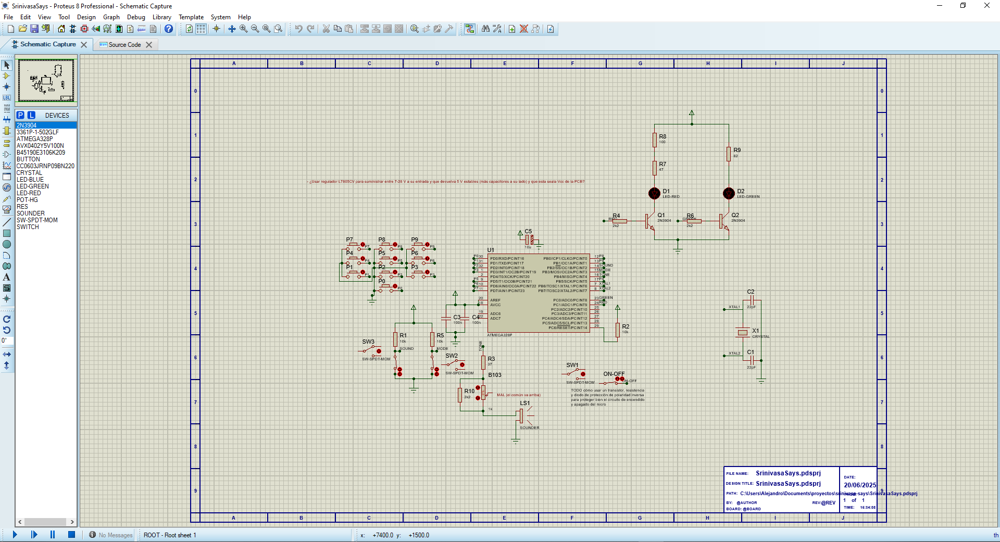 

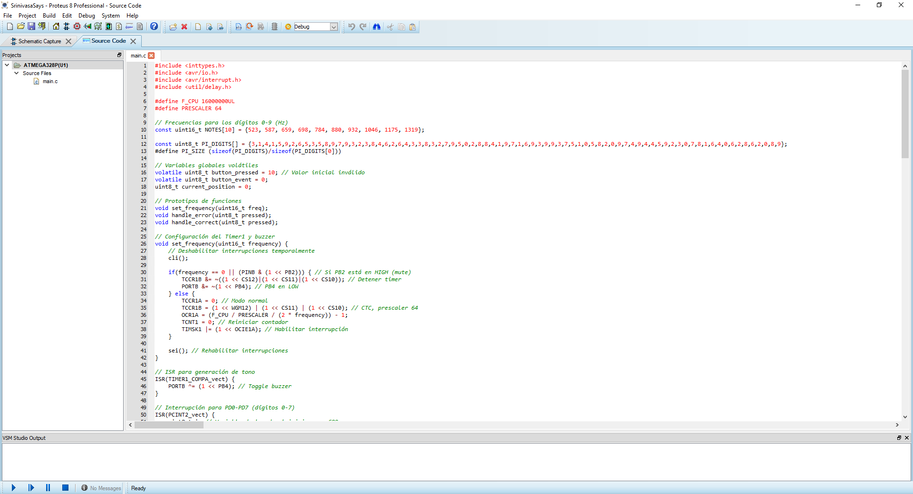

<video controls src="assets/proteus_video.mp4" title="proteus_video"></video> 

## Firmware

Usamos las bibliotecas C de AVR directamente desde el IDE de Proteus, entre otros.

¿Cómo grabar el código en el uC? ¿Escribir el código en el Arduino IDE y cargar desde ahí el archivo .hex? ¿O compilar los binarios (el .hex) desde otro lugar y cargarlo con avrdude, que es lo que utiliza Arduino IDE internamente? Existen varias formas...

El firmware se encuentra en la carpeta src por conveniencia. Se puede usar un compilador externo (como AVR-GCC o el de Atmel Studio) y solo usar en Proteus para simular. El ELF de depuración debería estar en la carpeta de compilación del proyecto (deshabilitando "Project => Project Settings => Embed Files" se deberían ver los archivos de texto y compilados en la carpeta del proyecto). Por otra parte, aunque el Arduino IDE no carga directamente archivos .hex en un microcontrolador AVR externo arbitrario, se puede hacer con la herramienta **avrdude**, la cual realmente usa internamente el Arduino IDE para subir código. Por ejemplo, con un comando similar a:

```bash
avrdude -c usbasp -p m328p -U flash:w:firmware.hex:i
```

> [!IMPORTANT]
> Para establecer los fusibles, se puede usar USBasp, AVRISP mkII, AVRDude o un Arduino (como programador) para configurar los fusibles.

Exploraremos un poco más las posibles opciones...

### Grabación de código

#### Opciones para grabar código en un microcontrolador AVR (ATmega328P, etc.)

Hay varias opciones para **grabar el código** en el uC. Para grabar código en un microcontrolador hay **dos aspectos fundamentales**:

1. **Cómo conectar físicamente el microcontrolador al ordenador (hardware de grabación)**
2. **Con qué herramientas compilar el programa y grabarlo en el microcontrolador (software de grabación)**

##### Métodos de conexión física

###### 1. Usar un Arduino como programador ISP (Arduino as ISP)

Se puede usar un Arduino Uno o Nano para programar otro microcontrolador AVR (como un ATmega328P DIP) usando la interfaz ISP, es decir conectando el uC que queremos programar a los pines ISP (MISO, MOSI, SCK, RESET, VCC, GND) de nuestro SBC Arduino (con condensador de 10µF entre el RESET y GND en el Arduino para evitar el reinicio automático).

- **Enlace ejemplo**: [Arduino Uno compatible](https://es.aliexpress.com/item/1005003194107627.html)
- Otro ejemplo, con un Nano: http://www.martyncurrey.com/arduino-nano-as-an-isp-programmer/

###### 2. Usar un programador dedicado (USBasp o STK500)

Estos programadores permiten grabar código directamente en el microcontrolador a través del conector ISP.

- **USBasp**: económico y popular → [ver en AliExpress](https://es.aliexpress.com/w/wholesale-USBasp.html). Ver este [tutorial completo](https://www.fischl.de/usbasp/) o estos vídeos: [vídeo 1](https://www.youtube.com/watch?v=cCfZ-qTPv10), [vídeo 2](https://www.youtube.com/watch?v=ToKerwRR-70). [Tutorial](https://www.learningaboutelectronics.com/Articles/Program-AVR-chip-using-a-USBASP-with-10-pin-cable.php?utm_source=chatgpt.com) de cómo programar. Otro [videotutorial](https://www.youtube.com/watch?v=t0PMDwGDF7Y).

- **STK500 AVR ISP**: alternativa más avanzada → [ver aquí](https://es.aliexpress.com/item/1005006205386137.html)

> [!NOTE]
> Las versiones de USBasp con jumper permiten alternar la tensión de alimentación de salida entre 3.3 V o 5 V, según el etiquetado en la PCB. Para un ATmega328P operativo a 16 MHz, Atmel especifica un voltaje mínimo de aproximadamente 3.78 V; 3.3 V queda por debajo de este umbral, por lo que no es seguro a plena velocidad. Habría que colocar el jumper en la posición 5 V.

###### 3. Programación por UART/FTDI (TX/RX)

Si el microcontrolador ya tiene cargado el **bootloader de Arduino**, se puede programar por serie (TX/RX) usando un adaptador FTDI.

- Ideal para placas personalizadas o microcontroladores SMD.
- Requiere un **bootloader pregrabado** (ver más abajo).
- **Tutorial útil**: [Programming ATmega en breadboard](https://shallowsky.com/blog/hardware/programming-breadboard-atmega.html)

##### 4. AVR ISP Shield (con Arduino)

Un **shield AVR ISP** para Arduino permite insertar directamente el microcontrolador en un zócalo y grabar código o bootloader usando el Arduino como ISP.

- Muy útil para cargar bootloaders o grabar microcontroladores sueltos en formato DIP.
- **Ejemplo de uso**: [Módulo programador con Arduino](https://www.youtube.com/watch?v=4bhVUhDkR68)

#### Herramientas de software para grabar código

##### 1. Arduino IDE

Se puede usar el propio entorno de Arduino para grabar programas (`.hex`) directamente en el uC destino:

- Usando el bootloader (por FTDI) como siempre.
- Usando "Arduino as ISP" como programador desde el menú Herramientas.
- También permite grabar el bootloader.
- Muy cómodo si lo que se quiere es recambiar el uC del Arduino por uno nuevo, e.g. porque se haya estropeado.

##### 2. avrdude

Programa en línea de comandos que permite grabar un `.hex` al microcontrolador.

- Realmente es lo que usa internamente Arduino IDE.
- Necesario para usar USBasp, ArduinoISP, etc., desde terminal o scripts.

Ejemplo de uso:
```bash
avrdude -c usbasp -p m328p -U flash:w:mi_programa.hex
```

[Tutorial](https://www.youtube.com/watch?v=asq_6g7qVhw&t=89s) de cómo instalarlo y especificarlo en el PATH del sistema.

Y cuenta con una GUI útil que facilita su uso, [avrdudess](https://blog.zakkemble.net/avrdudess-a-gui-for-avrdude/).

Para programar los fusibles, véase esta [útil herramienta](https://www.engbedded.com/fusecalc/) que está enlazada a la GUI de avrdudess.

> [!IMPORTANT]
> Usamos también la herramienta [Zadig](https://zadig.akeo.ie/) para que el programador USBasp funcione correctamente con los controladores específicos necesarios. Listamos todos los dispositivos desde Zadig tras conectar el programador ISP (denominado "USBHID" en nuestro caso) e instalamos el driver libusbK (v3.1.0.0) (recomendado). Ver problema de [USBasp no reconocible](https://electronics.stackexchange.com/questions/416714/avrdude-does-not-recognize-usbasp-device). Y [aquí](https://forum.arduino.cc/t/built-in-avrdude-refuses-to-work-with-usbasp-clone/995372/2) el mismo error. A mí me funcionó usar la opción -B y bajar la frecuencia de bits un poco, e.g. a 187,5 kHz.

> [!NOTE]
> Si nuestro programador aparece como HID en vez de como USBASP, necesitamos el [Chinese PROGISPV172](https://archive.org/details/prog-isp-ver-1.72-updated-chip), como mencionan [aquí](https://www.avrfreaks.net/s/topic/a5C3l000000UZPzEAO/t149941), (o descargar [aquí](https://mega.nz/folder/cpgQHbJT#17X4YvWeTgorBwN4hmH_YA)). Por ejemplo, esto pasa si usamos un clon del USBASP como un firmware no actualizado o fuera de lo común.

> [!WARNING]
> Error avrdude error: program enable: target doesn't answer (0x01): ver [EEVBLOG](https://www.eevblog.com/forum/microcontrollers/new-findings-avrdude-error-program-enable-target-doesnt-answer-(0x01)/). Y [aquí](https://forum.arduino.cc/t/avrdude-target-doesnt-answer-what-this-used-to-work/593903) el mismo error. A mí me funcionó usar la opción -B y bajar la frecuencia de bits un poco, e.g. a 187,5 kHz.

> [!WARNING]
> Si no somos capaces de hacer funcionar nuestro programador porque es un clon que utiliza firmware modificado, como fue el caso con el primero que adquirí, lo mejor será actualizar su firmware con el de USBASP más reciente que haya, ¿cómo? precisamente con otro programador USBASP funcional.

> [!NOTE]
> Los fusibles del uC de Proteus serían, con la configuración existente (aprox., pues no están todos);: 0x7F (L), 0xD9 (H), 0xFD (E), 0xFE (LB) (con brownout detection a 1.8 V)

Fusibles aproximados usados:

$$
\text{LFUSE} = 0x7F,\quad
\text{HFUSE} = 0xD9,\quad
\text{EFUSE} = 0xFD,\quad
\text{LOCK} = 0xFE
$$

##### 3. avr-gcc + Makefiles

Compilador de C para AVR. Necesario si se escriben programas en C puro.

- Se puede usar con make para compilar y luego grabar con avrdude.

##### 4. WinAVR

Paquete para Windows que incluye avr-gcc, avrdude, make, etc.

- Sitio: http://winavr.sourceforge.net/
- Desactualizado pero aún funcional.
- En Linux/macOS puedes instalar las herramientas por separado.

##### 5. PlatformIO

Extensión de VSCode para programar microcontroladores.

- Soporta placas AVR y Arduino.
- Muy útil para proyectos grandes o entornos modernos.

##### 6. Atmel/Microchip Studio (AVR Studio)

Entorno oficial de Microchip. Usaríamos GCC C Executable Project. Luego, tras escribir el .c, asegurarse de que la generación del archivo HEX está activado y presionar F7 o ve a Compilar → Compilar solución.

- Muy completo, con depuración y simulación.
- Usa sus propios programadores o puede trabajar con avrdude.

> [!NOTE]
> 🧠 ¿Y el Bootloader?
> Recuérdese, si se quiere programar por FTDI (TX/RX) como si fuera un Arduino, se necesitará tener el bootloader cargado en el microcontrolador, que se puede grabar con Arduino como ISP, USBasp o AVR ISP Shield, como se comentó antes.

### Decisión final

En **nuestro caso**, usamos el compilador WinAVR desde Proteus y Microchip Studio (AVR Studio) para generar el binario, como conexión física usamos un programador USBasp conectado al ATtiny85 a través de los pines ISP, y para grabar el código usamos avrdude para cargar el archivo .hex al microcontrolador. Ver [este tutorial](https://www.youtube.com/watch?v=cCfZ-qTPv10) de carga completa de programa en C sin bootloader, con USBASP, Atmel Studio y avrdude.

En la carpeta [build](./build/) se encuentra el binario .hex generado por Microchip Studio (AVR Studio). Este es el binario que se carga en el microcontrolador. Ver [README](./build/README.md).

## Enlaces de interés

- [Programador Uno/Nano](https://es.aliexpress.com/item/1005003194107627.html?algo_pvid=958e3e15-bde8-4cde-bfcf-c8f1a97886ad&algo_exp_id=958e3e15-bde8-4cde-bfcf-c8f1a97886ad-0&pdp_ext_f=%7B%22order%22%3A%224%22%2C%22eval%22%3A%221%22%7D&pdp_npi=4%40dis%21EUR%215.99%215.99%21%21%216.32%216.32%21%40211b80d117429030543694064e7ad4%2112000024599357026%21sea%21ES%216234875547%21X&curPageLogUid=u7eoiQz7eHrw&utparam-url=scene%3Asearch%7Cquery_from%3A)
- [USBasp](https://es.aliexpress.com/w/wholesale-USBasp.html?spm=a2g0o.home.search.0) o [STK500 AVR ISP](https://es.aliexpress.com/item/1005006205386137.html?spm=a2g0o.productlist.main.3.54b2625fOqIyBy&algo_pvid=9fafb5b1-bbd6-4c30-8688-489eee937017&algo_exp_id=9fafb5b1-bbd6-4c30-8688-489eee937017-1&pdp_ext_f=%7B%22order%22%3A%2253%22%2C%22eval%22%3A%221%22%7D&pdp_npi=4%40dis%21EUR%2139.43%218.53%21%21%21302.14%2165.35%21%40210385bb17428954799883511e822a%2112000036268214418%21sea%21ES%210%21ABX&curPageLogUid=hz4yJdBCLuMp&utparam-url=scene%3Asearch%7Cquery_from%3A)
- [Tutorial ATMega328p independiente de Arduino](https://digilogicelectronica.wordpress.com/2016/06/18/atmega328p-independiente-de-arduino-standalone/)
- [Tutorial grabación en ATMega328p](https://shallowsky.com/blog/hardware/programming-breadboard-atmega.html)
- [Módulo programar AVRs y PICs mediante ISP](https://www.youtube.com/watch?v=4bhVUhDkR68)
- [Make your own Arduino on a breadboard](https://www.youtube.com/watch?v=YMb_R6iFMBs)
- [Este tutorial](https://www.youtube.com/watch?v=cCfZ-qTPv10) de carga completa de programa en C sin bootloader, con USBASP, ATMel Studio y AVRDUDE.
- [Using Arduino as AVR ISP without bootloader](https://forum.arduino.cc/t/using-arduino-as-avr-isp-without-bootloader/116164)

## Generación de notas

Para generar una nota musical precisa en un ATmega328 usando un temporizador, véase la siguiente discusión:
1. Configurar los pines:

   PB0 (o el pin que se desee usar) se configura como salida para conectar un buzzer o altavoz.

2. Calcular el valor de comparación para el temporizador:

   Definir la frecuencia de la nota (por ejemplo, 440 Hz para la nota A4).

   Calcular el valor de comparación del temporizador (OCR1A) usando la fórmula:

OCR1A=(Prescaler×2×FrecuenciaFCPU​)−1

Fórmula del valor de comparación del temporizador:

$$
OCR1A = \frac{F_{\text{CPU}}}{2 \cdot \text{Prescaler} \cdot f_{\text{nota}}} - 1
$$

Por ejemplo, con un reloj de 16 MHz y un prescaler de 64, el valor de OCR1A para 440 Hz es 2800.

Ejemplo para una nota de 440 Hz, con:

- F_CPU = 16 MHz
- Prescaler = 64

$$
OCR1A = \frac{16\,000\,000}{2 \cdot 64 \cdot 440} - 1 \approx 2800
$$

3. Configurar el temporizador:

   Usar el temporizador 1 en modo CTC (Clear Timer on Compare Match).

   Configurar el prescaler (por ejemplo, 64).

   Establecer el valor de comparación OCR1A para generar una interrupción cada vez que el temporizador alcance el valor calculado.

4. Habilitar interrupciones:

   Habilitar las interrupciones globales con sei(), para que el microcontrolador pueda ejecutar el código de la interrupción cuando el temporizador llegue a su valor de comparación.

5. Interrupción del temporizador:

   En la rutina de interrupción ISR(TIMER1_COMPA_vect), alternar el estado de PB0 (buzzer), creando una onda cuadrada.

6. Ejecución del código:

   El microcontrolador genera la señal de la nota con el temporizador, mientras sigue ejecutando otras tareas.

Este enfoque permite generar notas musicales exactas con alta precisión, usando el temporizador para generar interrupciones de manera precisa y eficiente.

## Diseño mecánico

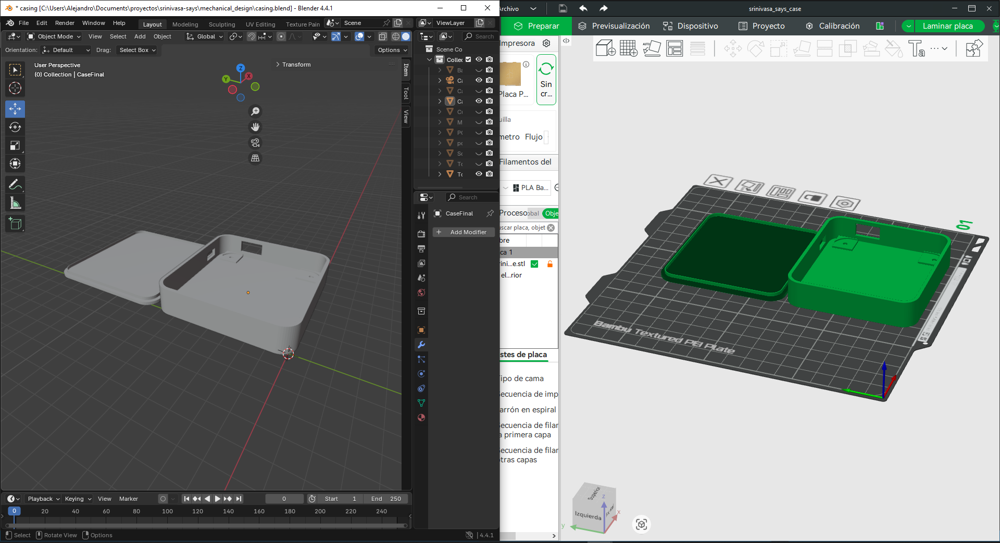

Los archivos CAD y 3D (STL, OBJ...) del diseño mecánico realizado están alojados en [Releases](https://github.com/user-attachments/files/19889748/mechanical_design.zip).

Diseñamos una sencilla carcasa para crear con impresora 3D y proteger nuestra PCB, que tendrá una serie de taladros para fijar a la carcasa => Intentamos usar Autodesk Fusion 360 (versión de uso personal, [gratuita](https://www.autodesk.com/products/fusion-360/appstream)). Sin embargo, no resultó tan bien como esperábamos y acabamos usando Blender.

La carcasa (ver imagen) está laminada con [BambuStudio](https://bambulab.com/es/download/studio) e impresa en mi propia impresora [Bambulab A1 mini](https://bambulab.com/es/a1-mini) con [PETG HF](https://eu.store.bambulab.com/es/products/petg-hf?p=W3sicHJvcGVydHlLZXkiOiJDb2xvciIsInByb3BlcnR5VmFsdWUiOiJCbGFuY28gKDMzMTAwKSJ9LHsicHJvcGVydHlLZXkiOiJUaXBvIiwicHJvcGVydHlWYWx1ZSI6IiJ9LHsicHJvcGVydHlLZXkiOiJUYW1hw7FvIiwicHJvcGVydHlWYWx1ZSI6IjEga2cifV0%3D).

Se ponen los taladros y diseño carcasa y PCB, etc. Se [exporta el STL](https://www.youtube.com/watch?app=desktop&v=F5EkDj69ieM) de la PCB de EasyEDA al programa de diseño.

Nótese que el propio EasyEDA te da la opción de diseñar una shell (carcasa) para la PCB, que la proteja, y que se puede imprimir en 3D, englobando la PCB en el diseño. Ver [este video](https://www.youtube.com/watch?v=4v2gWze6xi4). Sin embargo, esto puede ser aparatoso porque las huellas 3D de los componentes pueden ser erróneas; así que la diseñamos nosotros de cero.

En JLC3DP incluso se pueden encargar que nos impriman nuestras partes 3D, si queremos mejor calidad o son muy pequeñas: [ver](https://www.youtube.com/watch?v=bpns0GSR_zI).

- Ver [3D modelling General Plastic Enclosure With Autodesk Inventor](https://www.youtube.com/watch?v=YKPJ7_4PbZo).
- Ver [diseño fusion PCB](https://www.youtube.com/shorts/ji4PTDTPsoI).

Se descubrieron otras herramientas interesantes para el diseño:

- Esta web sirve para compartir diseños con la comunidad [Thingiverse](https://www.google.com/search?client=firefox-b-d&sca_esv=48b159fac8a0db64&q=Thingiverse&source=lnms&fbs=ABzOT_BnMAgCWdhr5zilP5f1cnRvK9uZj3HA_MTJAA6lXR8yQICx599sdFbm5siVC5WEzgEtp6o4DrSWTqdqZO8MP31kqbFKkqfL89nq1hvw37H6rIAZkda8kuMKVR-cNArA2C-Jqzbye-N8LF_PdCoDZ7Vk3Aa-uGiNe1r0OKhT74Chl1u6OO1zdLofrC-x1LqbUEmwe2Nm6KyK1QlH-CafREIBnR2Oag&sa=X&ved=2ahUKEwil2af39amMAxWPSvEDHZ0WNpsQ0pQJegQICRAB&biw=1728&bih=812&dpr=1.11).

- O también [Ultimaker Cura](https://www.google.com/search?client=firefox-b-d&q=ultimaker+cur), que es muy fácil de usar y es el que usaremos en [este proyecto](https://www.youtube.com/watch?v=4v2gWze6xi4).

- El CAD de los botones se recogió de [https://grabcad.com/library/tactile-switches-1](https://grabcad.com/library/tactile-switches-1). Con este CAD se diseñan las partes táctiles de los pulsadores, mediante modificadores Booleanos, extrusión de números, etc. De hecho los botones sí que se diseñaron en [Fusion](https://www.autodesk.com/es/products/fusion-360/overview). 

### Botonera

Una opción es poner botones normales sin aditivos y escribir en la PCB de cuáles se tratan, como [aquí](https://diyelectromusic.com/2023/03/04/tactile-button-keyboard-pcb/).

Otra opción es diseñar o comprar partes táctiles para los botones, si se puede, o buscar si hay botones con partes táctiles ya comerciales, como [estos](https://www.electrokit.com/en/knappar-pcb-sortiment-12st) pero con números. Si no simplemente habría que pensar cómo grabar los números en las partes táctiles.

O sea, se puede:
1. Buscar y comprar botones numerados ergonómicos. Una buena opción sería [esta](https://www.youtube.com/watch?v=N4cLFE0FF2U), que compra botones como los del PC para la PCB. O p. ej. [estos](https://www.sunrom.com/p/blue-cap-r55x31mm-for-switch-6x6-9h-20h).
2. Diseñar para imprimir en 3D las carcasas de los botones; en este caso puede ser mejor idea usar botones [de tallo largo](https://www.electrokit.com/en/tryckknapp-pcb-12x12x15mm), como [aquí](https://thewarthogproject.com/keypads-and-buttons). Ver también [este proyecto](https://www.youtube.com/watch?v=3B-CjQDQ850) guapísimo personalizando botones complejos. Se pueden replicar por ejemplo [estos](https://www.sunrom.com/p/blue-cap-r55x31mm-for-switch-6x6-9h-20h).
3. Pegar adhesivos o grabar tallando el número en las carcasas de los botones.
4. Simplemente escribir el número debajo de los botones, en la PCB.

Se les puede poner un poco de Loctite por dentro para que no se suelten.

## Troubleshooting

- Los buzzers pueden variar de forma significativa su resistencia interna.
  Debido a esto, suele ser necesario **ajustar los valores del divisor resistivo** para que el sonido sea agradable y no sature.
  Desoldar un buzzer es un suplicio, así que conviene afinar esto desde el principio.

## TODO

- Actualizar el firmware del **programador USBasp azul chino** usando un USBasp funcional.
  - La prueba de fuego es que `avrdude` lo reconozca correctamente como USBasp.

- Comprobar en el datasheet:
  - **¿Puede AVCC quedar flotante realmente?**

- Añadir una **protección en serie con el switch de alimentación**, como en el esquema de SensoCard.

## Ideas y notas

### Microcontrolador y arquitectura

- ¿Qué microcontrolador elegir?
  Debe permitir **actualizaciones y nuevas funcionalidades a futuro**, y ser **fácilmente reprogramable**.

  - Idealmente, el micro debería poder **sacarse y volver a colocarse** en caso de fallo.
  - Por tanto, el **encapsulado debería ser DIP**.

- Uno de los mejores posibles candidatos que vi es el **ATMega328PU**:
  [https://es.aliexpress.com/item/1005004505177113.html](https://es.aliexpress.com/item/1005004505177113.html)

### Programación y firmware

- ¿Cómo grabar el código?

  - Opción 1: usar un **Arduino Uno/Nano** como programador y grabar desde el **Arduino IDE**.
  - Opción 2: usar un **bootloader** externo (por ejemplo, STK500):
    [https://es.aliexpress.com/w/wholesale-STK500-serial-bootloader.html](https://es.aliexpress.com/w/wholesale-STK500-serial-bootloader.html)

- Generación de PWM:

  - Programar a bajo nivel mediante **registros AVR** (ver [este artículo](https://www.laboratoriogluon.com/generar-senal-pwm-para-servo-con-avr-atmega328p/)).
  - O usar las **librerías de Arduino** y programar en el entorno Arduino/Processing.

- Investigar cómo usar directamente la **librería C de AVR (avr-libc)**:
  [https://github.com/avrdudes/avr-libc](https://github.com/avrdudes/avr-libc)

- Ver este ejemplo de programación en C "a pelo" del ATMega328PU usando ISP desde otro Arduino (sin librerías Arduino):
  [https://www.brennantymrak.com/articles/programming-avr-with-arduino](https://www.brennantymrak.com/articles/programming-avr-with-arduino)

- En el firmware, se configuran los **pines no usados como salidas con pulldown**.

### Hardware y electrónica

- Se valora la inclusión de switches:

  - Switch de **modos de juego**
  - Switch general de **encendido/apagado**
  - Switch de **sonido ON/OFF**
    Referencia: [https://learn.sparkfun.com/tutorials/simon-says-assembly-guide/all](https://learn.sparkfun.com/tutorials/simon-says-assembly-guide/all)
  - Switches adecuados:
    - [https://es.aliexpress.com/item/1005008323898793.html](https://es.aliexpress.com/item/1005008323898793.html)
    - [https://es.aliexpress.com/i/1000007042312.html](https://es.aliexpress.com/i/1000007042312.html)

- Nos inspiramos en este conector USB en esta PCB de Picduino:
  - [https://images.app.goo.gl/U2B7Egxq9e5GNpYcA](https://images.app.goo.gl/U2B7Egxq9e5GNpYcA)

- También podría haberse usado una **pila + boost converter a 5 V**, como aquí:
  - [https://www.instructables.com/Merry-GIF-mas-a-Christmas-Ornament/](https://www.instructables.com/Merry-GIF-mas-a-Christmas-Ornament/)

- Se valora la inclusión de un **potenciómetro al ADC** para controlar el volumen. Idealmente usar un **trimmer** para afinar el sonido.

- Podría añadirse una **batería recargable**.

- Se valora el uso de un **regulador L7805CV**:
  - Entrada: 7–28 V
  - Salida: 5 V estables (con los condensadores adecuados)
  - Esta salida sería el **Vcc de la PCB**

- Cada vez que se falle una partida y se consiga un **nuevo récord**:
  - Almacenar el récord en memoria **no volátil** (interna o externa).
  - Reproducir una melodía y mostrar/sonar todas las cifras del récord.
  - Añadir un botón pequeño para **resetear el récord**.

### PCB y diseño físico

- Se podría usar el **osciloscopio** en un apartado de análisis de resultados para:
  - Ver la señal PWM u otras señales relevantes.
  - Incluir capturas.

- Se valoró diseñar una PCB, o un carcasa, con forma de **π (Pi)**:
  - Ver este vídeo: [https://www.youtube.com/watch?v=HOwg0021fyQ](https://www.youtube.com/watch?v=HOwg0021fyQ)
  - Podría además, por las geometrías agudas o rectas, estudiarse:
    - Compatibilidad electromagnética (CEM)
    - Ruido en ángulos de la PCB
    - Viabilidad de formas no rectangulares
  - Se incluye (como chuleta) la **ecuación de Srinivasa Ramanujan** como arte grabado en la PCB.

- Habría que ver si los fabricantes de PCB **aceptan formas raras**.

- O incluso se podrían diseñar botones con **grabados personalizados** (por ejemplo, emojis) para los switches. Habría que atender a la resolución máxima de la impresora 3D.

- Se podría usar el **foam del starter kit de la RP4** para fijar la PCB con Loctite en la carcasa.

- Y escanear la **protoboard terminada con NERF / GS3D** para no perder el diseño físico (ver [mi post de NeRF](https://agarnung.github.io/blog/nerfstudio#object-scanning)).

## References

- Proyecto completo de **Robert Feranec**:
  - Playlist: [https://www.youtube.com/playlist?list=PLXvLToQzgzdftro2qK5In8p6ExsDFdpzw](https://www.youtube.com/playlist?list=PLXvLToQzgzdftro2qK5In8p6ExsDFdpzw)
  - GitHub: [https://github.com/FEDEVEL/custom-keyboard](https://github.com/FEDEVEL/custom-keyboard)

- Proyecto conciso usando Fusion 360:
  - [https://www.youtube.com/watch?v=P_oSLBZABGA](https://www.youtube.com/watch?v=P_oSLBZABGA)

- [https://www.linkedin.com/posts/informative-engineering_solar-energy-codes-permitting-and-zoning-activity-7309615537154600960-yaK5](https://www.linkedin.com/posts/informative-engineering_solar-energy-codes-permitting-and-zoning-activity-7309615537154600960-yaK5)

- SparkFun Simon Says Assembly Guide:
  - [https://learn.sparkfun.com/tutorials/simon-says-assembly-guide/all#final-assembly](https://learn.sparkfun.com/tutorials/simon-says-assembly-guide/all#final-assembly)

- ATMega328P standalone:
  - [https://digilogicelectronica.wordpress.com/2016/06/18/atmega328p-independiente-de-arduino-standalone/](https://digilogicelectronica.wordpress.com/2016/06/18/atmega328p-independiente-de-arduino-standalone/)

- Guía clara de programar firmware con Arduino como ISP:
  - [https://lab.bricogeek.com/tutorial/como-usar-un-arduino-uno-como-programador-isp](https://lab.bricogeek.com/tutorial/como-usar-un-arduino-uno-como-programador-isp)

- Ejemplos con Arduino UNO:
  - [https://hackaday.io/project/188876-simon-says-game](https://hackaday.io/project/188876-simon-says-game)
  - [https://trybotics.com/project/breadboard-to-pcb-part-1-making-the-simon-says-game-4a3e8a](https://trybotics.com/project/breadboard-to-pcb-part-1-making-the-simon-says-game-4a3e8a)

- Diseño de taladros (screws) en el esquemático:
  - [https://github.com/PHochmann/Senso/blob/master/Hardware/SensoCard/SensoCard-Schematic.png](https://github.com/PHochmann/Senso/blob/master/Hardware/SensoCard/SensoCard-Schematic.png)

- Diseño de carcasa superior e inferior en Fusion 360 para la PCB:
  - [https://github.com/PHochmann/Senso/blob/master/SensoCard-Holder.stl](https://github.com/PHochmann/Senso/blob/master/SensoCard-Holder.stl)
  - [https://cults3d.com/en/3d-model/gadget/customizable-pcb-box-fusion-360](https://cults3d.com/en/3d-model/gadget/customizable-pcb-box-fusion-360)
  - [https://www.youtube.com/watch?v=uUJqQ6guGBE](https://www.youtube.com/watch?v=uUJqQ6guGBE)

- Reproducción de sonido con speaker:
  - [https://www.build-electronic-circuits.com/arduino-speaker/](https://www.build-electronic-circuits.com/arduino-speaker/)

- Arduino UNO DIY minimalista:
  - [http://garytuttle.com/ee333/topics/bareduino.pdf](http://garytuttle.com/ee333/topics/bareduino.pdf)

- ATMega328P Datasheet:
  - [https://ww1.microchip.com/downloads/en/DeviceDoc/ATmega48A-PA-88A-PA-168A-PA-328-P-DS-DS40002061B.pdf](https://ww1.microchip.com/downloads/en/DeviceDoc/ATmega48A-PA-88A-PA-168A-PA-328-P-DS-DS40002061B.pdf)

- USBasp y AVR:
  - [https://www.avrfreaks.net/s/topic/a5C3l000000Uap2EAC/t155336](https://www.avrfreaks.net/s/topic/a5C3l000000Uap2EAC/t155336)
  - [https://www.tiendatec.es/maker-zone/programadores/526-programador-usbasp-v20-avr-icsp-con-cable-para-arduino-8405261440008.html](https://www.tiendatec.es/maker-zone/programadores/526-programador-usbasp-v20-avr-icsp-con-cable-para-arduino-8405261440008.html)

- Drivers USBasp Windows 10:
  - [https://jfetronic.wordpress.com/drivers-del-programador-usbasp-avr-para-micros-atmel/](https://jfetronic.wordpress.com/drivers-del-programador-usbasp-avr-para-micros-atmel/)

- Soldadura THT:
  - [https://www.youtube.com/watch?v=VxMV6wGS3NY](https://www.youtube.com/watch?v=VxMV6wGS3NY)

- Senso / SensoCard:
  - [https://github.com/PHochmann/Senso/tree/master](https://github.com/PHochmann/Senso/tree/master)

- Cómo crear PCB personalizadas con PCBWay:
  - [https://www.youtube.com/watch?v=RfGuJ5nTeVw](https://www.youtube.com/watch?v=RfGuJ5nTeVw)

- Diseño de carcasas PCB:
  - [https://www.youtube.com/watch?v=7FC-pByCCXM](https://www.youtube.com/watch?v=7FC-pByCCXM)

- Modelado en Blender:
  - [https://www.youtube.com/watch?v=FpvhDspqvHw](https://www.youtube.com/watch?v=FpvhDspqvHw)
